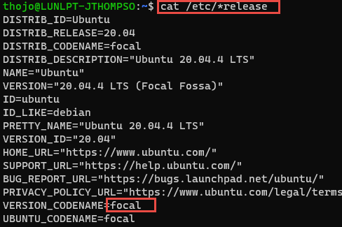

I recently started scripting with Azure CLI within my Windows Subsystem for Linux (WSL) environment and tried to create a database on an Azure Database for MySQL Flexible-Server instance and received an error 'flexible-server' is not in the 'az mysql' command group. I also tried to list out the flexible-servers in my subscription, but it also give the same error!

I tried to see if maybe my Azure CLI was out of date, but it was already at the newest version!


As I test, I tried running the command in Microsoft's pre-package Azure CLI Docker container within my WSL Ubuntu environment: (You will need Docker Desktop installed)
 
`~$ docker run -it mcr.microsoft.com/azure-cli`
 
Sure enough, it worked just fine! Something is wrong with my installation of Azure CLI within the WSL environment. It is a relatively new install, so possibly Azure CLI did not install completely when setting up WSL…

Not matter, I found the instructions for reinstalling Azure CLI here… 
[Install the Azure CLI on Linux](https://docs.microsoft.com/en-us/cli/azure/install-azure-cli-linux?pivots=apt)

1. Get packages needed for the install process:
```
~$ sudo apt-get update
~$ sudo apt-get install ca-certificates curl apt-transport-https lsb-release gnupg
```
2. Download and install the Microsoft signing key:
```
~$ curl -sL https://packages.microsoft.com/keys/microsoft.asc |
    gpg --dearmor |
~$ sudo tee /etc/apt/trusted.gpg.d/microsoft.gpg > /dev/null
 ```
3) Add the Azure CLI software repository:
```
~$ AZ_REPO=$(lsb_release -cs)
~$ echo"deb [arch=amd64] https://packages.microsoft.com/repos/azure-cli/ $AZ_REPOmain"|
    sudo tee /etc/apt/sources.list.d/azure-cli.list
```
**Note:** This step did not work as expected in the WSL Ubuntu environment, lsb_release doesn't return any information, so you have to set AZ_REPO environment variable manually:
1.	Execute "cat /etc/*release"
 
2.	Look for VERSION_CODENAME, or UBUNTU_CODENAME, which in our case is **focal**
3.	Now you can continue with the rest of the command:
```
~$ AZ_REPO=focal
~$ echo"deb [arch=amd64] https://packages.microsoft.com/repos/azure-cli/ $AZ_REPOmain"|
    sudo tee /etc/apt/sources.list.d/azure-cli.list
``` 
4) Update repository information and install the azure-cli package:
``` 
~$ sudo apt-get update
~$ sudo apt-get install azure-cli
``` 
The az mysql flexible-server module did not light up right away, I had to restart my Ubuntu WSL session. After that, it works fine!
